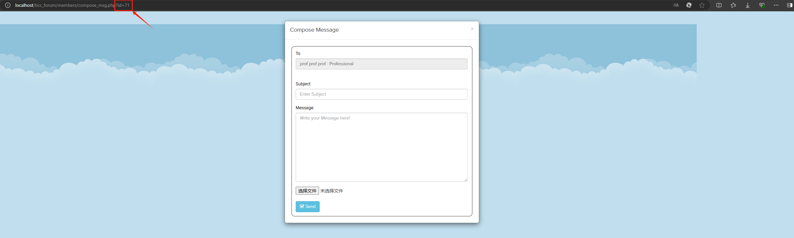
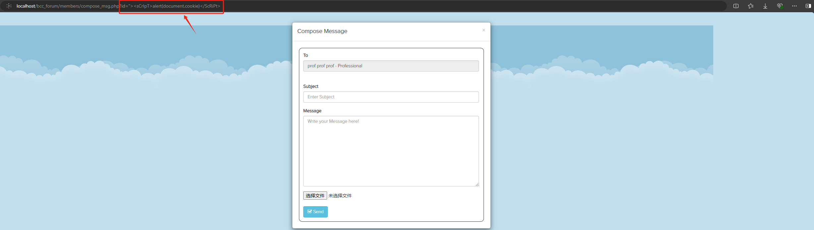
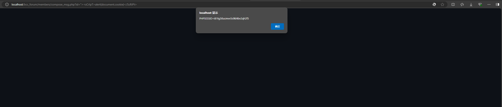

# System-with-Cross-site-Scripting-XSS-

Vul_Author: WangTY-Sama

vendors: https://itsourcecode.com/free-projects/php-project/online-discussion-forum-project-in-php-with-source-code/

Vulnerability File: 

Vulnerability location: 

[+] Payload: "><sCrIpT>alert(document.cookie)</ScRiPt>

Tested on Windows 11, phpStudy

There is an example with alert:

When you enter the system, click the hyperlink next to "prof | Professional" and transfer to Compose Message page.

You can see that the URl of Compose Message page is http://localhost/bcc_forum/members/compose_msg.php?id=71.

We replace "71" with 
```
"><sCrIpT>alert(document.cookie)</ScRiPt> 
```

then press Enter, you will obtain its cookie.

